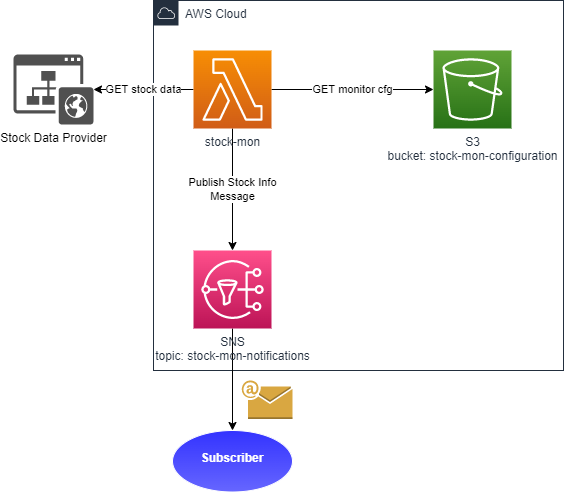
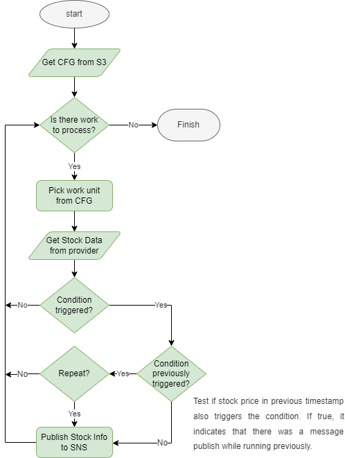

# Stock Monitor
Stock Monitor polls the Stock Data Provider regularly to retrieve target stock price data based on a configuration 
stored on S3. Each stock price is tested against defined price threshold and when the condition is meet a message is 
sent to subscribers via SNS.

## Informational Message

The message sent to users when a condition is meet has the following format:

```shell
Stock <ticker> reached the price R$<actual-price> at <date-time>.
Conditional: <bellow|above>
Price: <target-price>
```

## Configuration

Stock monitoring is based on conditions which have the following attributes:

```
{
  "ticker": "<stock-ticker>",
  "trigger": "<bellow|above (default)>",
  "price": <target-price>,
  "repeat": <true|false (default)>
}
```

- **ticker** - stock ticker
- **trigger** - type of condition that triggers this condition
  - *above* (default) - trigger if stock price is above target price
  - *bellow* - trigger if stock price is bellow target price
- **price** - target stock price used to compare against trigger price
- **repeat** - resend notifications if condition keeps being meet in consecutive executions. Default is *false* to 
  don't repeat

A monitoring configuration file stored in S3 is just a set of conditions:

```json
[
  {"ticker": "AERI3", "trigger":"bellow", "price": 6.95 },
  {"ticker": "AERI3", "price": 8 },
  {"ticker": "TAEE4", "trigger":"bellow", "price": 11.50 },
  {"ticker": "TAEE4", "trigger":"bellow", "price": 11.30, "repeat": true }
]
```

## Architecture



The solution has the following components:
- **Stock Data Provider** - third party provider from which stock price data is retrieved
- **S3 bucket** - where configuration used in the monitoring is stored
- **SNS topic** - provides a way to notify users (subscribers) when a price change triggers some condition
- **Lambda function** - glue together all services and runs the solution logic to test stock prices against conditions


## Solution Flowchart



1. **Get CFG from S3** - retrieve monitoring configuration from S3 bucket
2. **If there is no conditions** to test, just **finish**;
3. **If there is conditions** to test, **pick one** from the configuration;
4. **Get target Stock Data from provider**
5. Compare most up-to-date stock price data received from provider with price condition from configuration
   * **If condition NOT triggered**, go back to step 2
6. **If condition DID trigger**, check if condition was already triggered in previous execution
   * **If condition NOT triggered previously**, create and publish informational message to SNS
7. **If condition triggered previously**
   * **AND NOT** configured to repeat, go back to step 2
   * **AND** configured to repeat, create and publish information message to SNS


## Environment

The following configuration may be set as environment variables:

- **BUCKET** - S3 bucket to look for configuration
  - _default_: `stock-monitor`
- **CONFIG** - key to look configuration file inside bucket (may be a full file path)
  - _default_: `conditions.json`
- **REGION** - S3 bucket region
  - _default_: `sa-east-1`
- **PRICES_PROVIDER_URL** - URL to Stock Data provider in the format `protocol + hostname`
  - _default_: `https://statusinvest.com.br`
- **PRICESS_PROVIVER_USER_AGENT** - user agent header value
  - _default_: `Mozilla/5.0 (Windows NT 10.0; Win64; x64) AppleWebKit/537.36 (KHTML, like Gecko) Chrome/95.0.4638.54 Safari/537.36`

