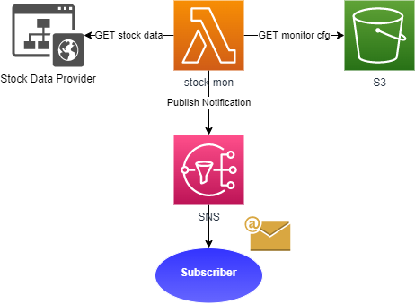

# Stock Monitor
Stock Monitor is a **Lambda function** that polls the **Stock Data Provider** regularly to retrieve target stock price 
data based on a configuration stored in **S3**. Each stock price is tested against defined price threshold; when the 
condition is meet a message is sent to subscribers via **SNS**.

## Informational Message

The message sent to users when a condition is meet has the following format:

```shell
Stock <ticker> reached the price R$<actual-price> at <date-time>.
Conditional: <bellow|above>
Price: <target-price>
```

## Configuration

Stock monitoring is based on conditions which have the following attributes:

```
{
  "ticker": "<stock-ticker>",
  "trigger": "<bellow|above (default)>",
  "price": <target-price>,
  "repeat": <true|false (default)>
}
```

- **ticker** - stock ticker
- **trigger** - type of condition that triggers this condition
  - *above* (default) - trigger if stock price is above target price
  - *bellow* - trigger if stock price is bellow target price
- **price** - target stock price used to compare against trigger price
- **repeat** - resend notifications if condition keeps being meet in consecutive executions. Default is *false* to 
  don't repeat

A monitoring configuration file stored in S3 is just a set of conditions:

```json
[
  {"ticker": "AERI3", "trigger":"bellow", "price": 6.95 },
  {"ticker": "AERI3", "price": 8 },
  {"ticker": "TAEE4", "trigger":"bellow", "price": 11.50 },
  {"ticker": "TAEE4", "trigger":"bellow", "price": 11.30, "repeat": true }
]
```

## Architecture

### Sketch



The solution has the following components:
- **Stock Data Provider** - third party provider from which stock price data is retrieved
- **S3 bucket** - where configuration used in the monitoring is stored
- **SNS topic** - provides a way to notify users (subscribers) when a price change triggers some condition
- **Lambda function** - glue together all services and runs the solution logic to test stock prices against conditions

### Expanded


## Solution Flowchart


1. **Get CFG from S3** - retrieve monitoring configuration from S3 bucket
2. **If there is no conditions** to test, just **finish**;
3. **If there is conditions** to test, **pick one** from the configuration;
4. **Get target Stock Data from provider**
5. Compare most up-to-date stock price data received from provider with price condition from configuration
   * **If condition NOT triggered**, go back to step 2
6. **If condition DID trigger**, check if condition was already triggered in previous execution
   * **If condition NOT triggered previously**, create and publish informational message to SNS
7. **If condition triggered previously**
   * **AND NOT** configured to repeat, go back to step 2
   * **AND** configured to repeat, create and publish information message to SNS


## Environment

The following configuration may be set as environment variables:

- **TOPIC** - target ARN from SNS topic
  - **MUST** be specified as there is no default value.
- **BUCKET** - S3 bucket to look for configuration
  - _default_: `stock-monitor`
- **CONFIG_KEY** - key to look configuration file inside bucket (can be a full file path)
  - _default_: `conditions.json`
- **REGION** - S3 bucket region
  - _default_: `sa-east-1`
- **PRICES_PROVIDER_URL** - Stock data provider URL in the format `protocol + hostname`
  - _default_: `https://statusinvest.com.br`
- **PRICES_PROVIDER_USER_AGENT** - user agent when requesting data from stock data provider
  - _default_: `Mozilla/5.0 (Windows NT 10.0; Win64; x64) AppleWebKit/537.36 (KHTML, like Gecko) Chrome/95.0.4638.54 Safari/537.36`

## Run Locally

Execute unit tests:
```shell
npm test
```

Execute the function locally, but using real resources:
```shell
npm start
```
To execute locally you must setup:

- An AWS SNS Topic and configure the environment variable **TOPIC** with the topic ARN
- An AWS S3 Bucket that can be specified via environement variables **BUCKET** and **CONFIG**
- Setup the AWS credentials so the local running function can use AWS resources

### AWS Credentials
When running locally, this service depends on AWS credentials file located in the user home to be allowed to
s3:GetObject from S3 and sns:Publish to SNS.

Check AWS docs on how to setup the credentials: https://docs.aws.amazon.com/sdk-for-java/v1/developer-guide/setup-credentials.html

## Run with terraform

Terraform creates all necessary infrastructure automatically in AWS Cloud. It only required to setup AWS credentials 
so terraform can issue commands to AWS.

**WARNING**: terraform launch create many resources and links, but it has some problems when shutting down the setup.
Some resources may have to be removed manually. So use terraform only if you are confident you can remove some 
resources manually (they are listed along the destroy command doc).

From `terraform/` directory:

Initialize terraform:
```shell
terraform init
```

Create the infrastructure:
```shell
terraform apply -auto-approve -var='email_subscriber=user@provider.com'
```

- `auto-approve` is used to auto confirm the deploy. Skip this option if you want to take a look in everything that 
  will be created by terraform
- `-var'email_subscriber=user@provider.com'` defines the testing e-mail to receive prices notification. AWS 
  will send an e-mail to confirm the subscription
  - The subscribing e-mail can also be set inside terraform.tfvars in the format 
    `email_subscriber=user@provider.com`
- `conditions.json` file from project folder is used as conditions configuration. The target file can be changed by 
  editing `terraform.tfvars`
- `terraform.tfvars`file allows customizing all available environment variables

List everything created and managed by terraform:
```shell
terraform state list
```

List a target resource status:
```shell
terraform state show <type.resource>
```

**Get `<type.resource>` combination from `terraform state list` command output*

Destroy the infrastructure:
```shell
terraform destroy -auto-approve -var='email_subscriber=dummy'
```

- Terraform still requires vars to be defined, but they aren't required while destroying in this project 
- Pending subscriptions can't be removed manually and are automatically deleted by AWS after some time (3 days)

**WARNING:** Terraform has a bug that prevents it from removing the lambda ENIs, so destroying command gets 
stuck while removing the Security Group because there is attached ENIs to it. To remove manually, you can try deleting 
the Security Group to get the list of ENIs to remove them (if they show as in use, just wait a few minutes before 
retrying). If is not possible to remove the ENIs even after waiting, stop terraform destroy operation and retry 
deleting the ENIs after that. Then, re-execute terraform destroy command.
